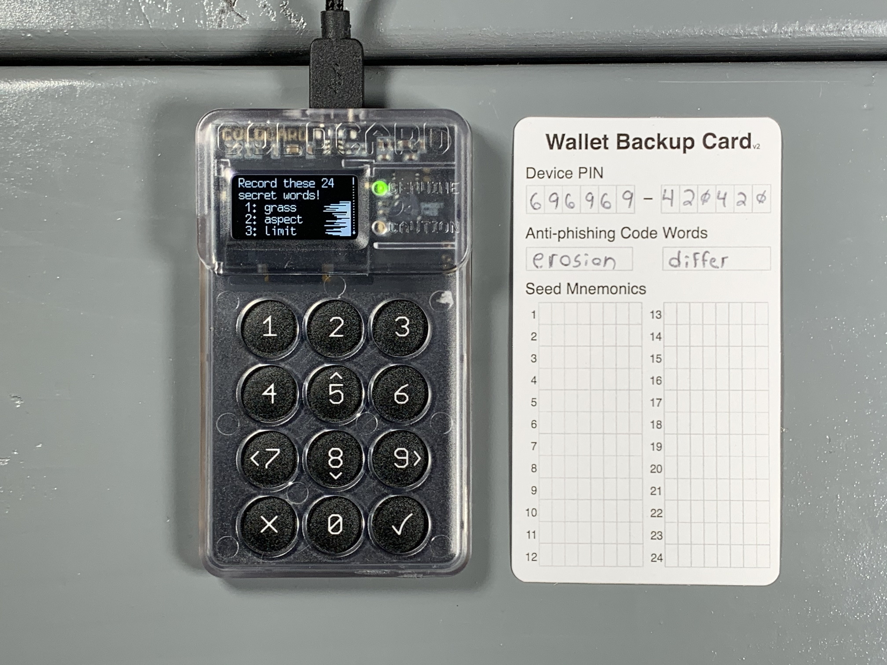
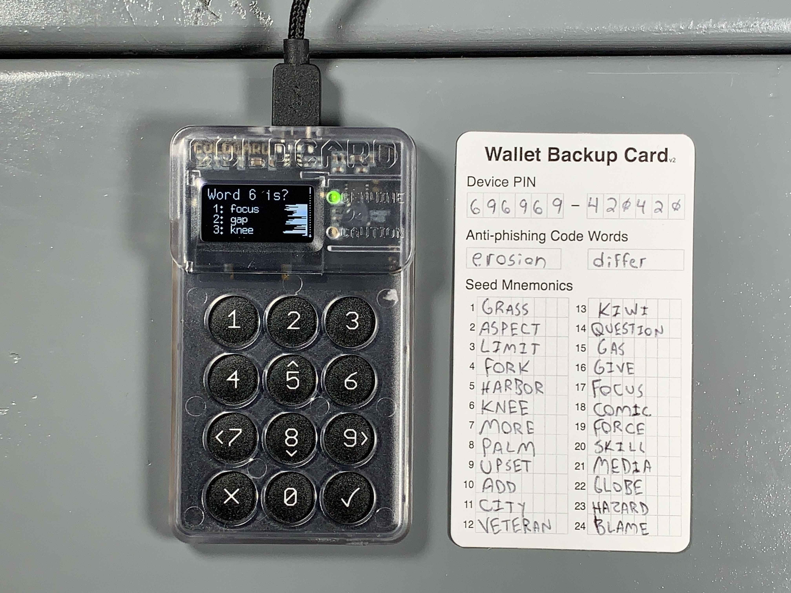

## Generating a seed phrase
There are a couple considerations you may want to make when creating a seed phrase. For example, COLDCARD will generate a seed phrase for you by default, as shown in this guide. However, maybe you don't trust the True Random Number Generator (TRNG) in your COLDCARD, you can introduce some of your own randomness as shown in the [Middle Ground](https://www.github.com/econoalchemist/ColdCard-MiddleGround/) guide.

First, Select `New Wallet` and after a moment you will be presented with 24 words. Write these words down in order on your notecard. Then double check your work.

  
  
  

Next, you will be tested on your seed words to ensure you wrote them down correctly. After passing the test, you will be in the COLDCARD main menu. Make sure you store your notecard securely. Anyone who gains access to your seed phrase will be able to steal your bitcoin. Never share your seed phrase with anyone.

  

Best practice is to test your backup information before depositing any bitcoin. The basic idea is to use only your written backup information in an attempt to restore your wallet. If all of your backup information is correct and you successfully restore your wallet then you know that you can recover any bitcoin deposited to that wallet with that backup information. First you need a way to identify your wallet. Your newly generated wallet has a unique fingerprint which you can find from the main menu by navigating to `Advanced` > `View Identity`. You will find a unique 8-character fingerprint such as `99E870EF`. Write that fingerprint down. Now you can destroy the seed on your COLDCARD by again navigating to `Advanced` then `Danger Zone` > `Seed Functions` > `Destroy Seed`. Then you will be presented with a couple of warnings, after confirming, your seed will be destroyed and you will be brought back to the login page where you enter your PIN. Log back into your COLDCARD and from the main menu navigate to `Import Existing` > `24 words` and then start entering your seed words in order from your backup card. Start by scrolling down until you see the first letter of your word, then scroll down to the next nearest part of the word, and keep narrowing down the search until you arrive at the word you need. For example, `t` > `th` > `thr` > `throw` then hit <kbd>OK</kbd> and repeat the process for the next word. If you make a mistake, you can hit <kbd>Cancel</kbd> to go back and reselect a word. After you enter the 23rd word, COLDCARD will compute a list of 8 possible options for your 24th word. Select your 24th word from that list. If you do not see your 24th word on that list then you either made a mistake entering the first 23 words or you wrote down your backup information incorrectly. After selecting the 24th word and hitting <kbd>OK</kbd> the seed will be applied and then you can navigate back to `Advanced` > `View Identity` and confirm the fingerprint is correct.    

