## Connecting & transacting with Sparrow Wallet
Sparrow Wallet is a Bitcoin wallet designed to be connected with your own node and ran from your desktop computer. This is a user-friendly wallet with an intuitive interface and many advanced features for a range of capabilities. To learn more about Sparrow Wallet and for installation instructions, visit the [Sparrow Wallet website](https://www.sparrowwallet.com/).

In this guide you will see how to connect your COLDCARD to Sparrow Wallet using a reputable public Electrum server as the backend. 

Once you install Sparrow Wallet and launch the application, you will be presented with an empty user interface. Navigate to `File` > `Preferences`.

  

Then click on the <kbd>Server</kbd> tab on the left-hand side. Select <kbd>Public Server</kbd> at the top, choose a public server from the drop down menu, then click on <kbd>Test Connection</kbd>. It should only take a moment for a successful connection to be made. You may have to try a couple different public servers to get a good connection. 

  
  

Keep in mind that with this configuration, you are using a public Electrum server which means that your transactions will broadcast to a public server. This also means you are trusting someone else's node. Your bitcoin is not at risk but this method has a privacy tradeoff that is worth considering. In the [Middle Ground](https://www.github.com/econoalchemist/ColdCard-MiddleGround/) guide, more privacy-focused options are covered. To learn more about Sparrow Wallet best practices, check out [this](https://www.sparrowwallet.com/docs/best-practices.html) guide. 

You will notice in the Sparrow Wallet interface lower right-hand corner that the toggle switch color has changed to yellow. This indicates that your wallet is using a public Electrum server as the back end. 

You can create your new wallet by selecting `File` > `New Wallet`, then you will be asked to name this wallet. Name the wallet whatever you want then click on <kbd>Create Wallet</kbd>. 

  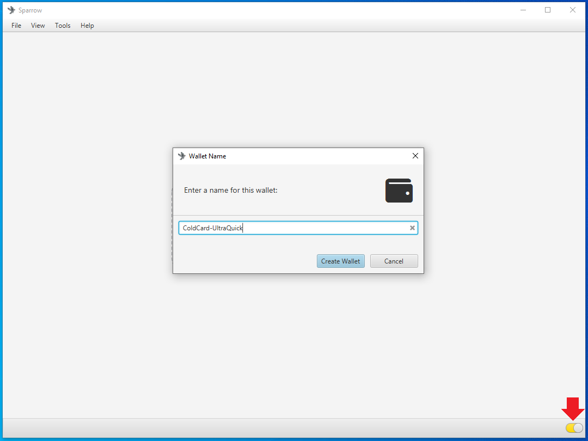

You will see the following screen, you can leave all the settings on the defaults. Plug your COLDCARD into the desktop and log into it if you haven't done so already before clicking on the <kbd>Connected Hardware Wallet</kbd> button.

  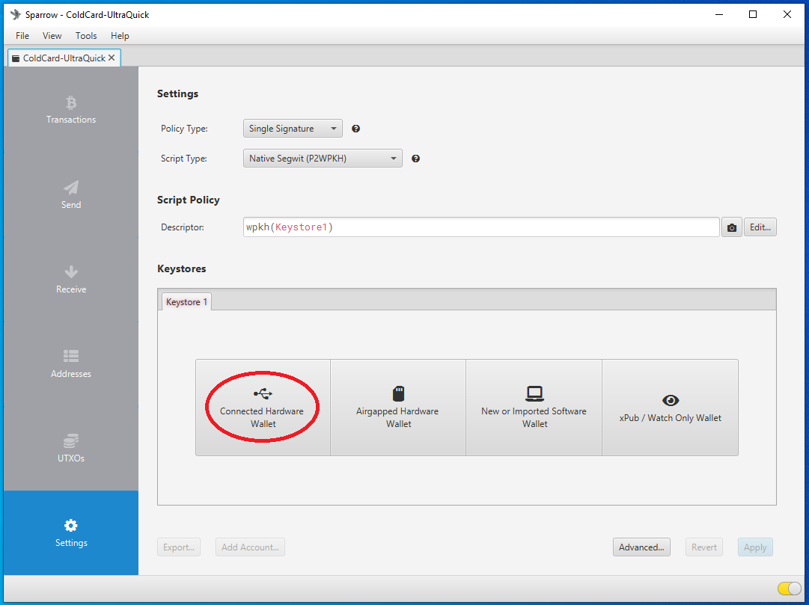

Next, a screen will pop up and you can click on the <kbd>Scan...</kbd> button. Then after a moment you should see COLDCARD appear on screen with an <kbd>Import KeyStore</kbd> button, click on that button. 

  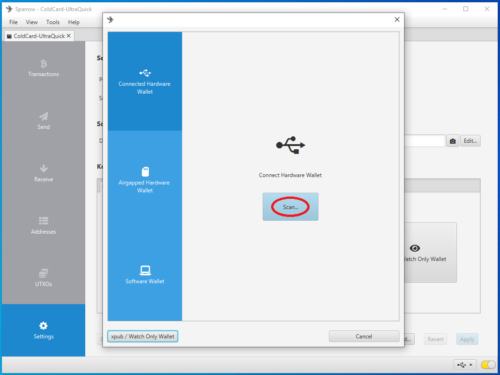
  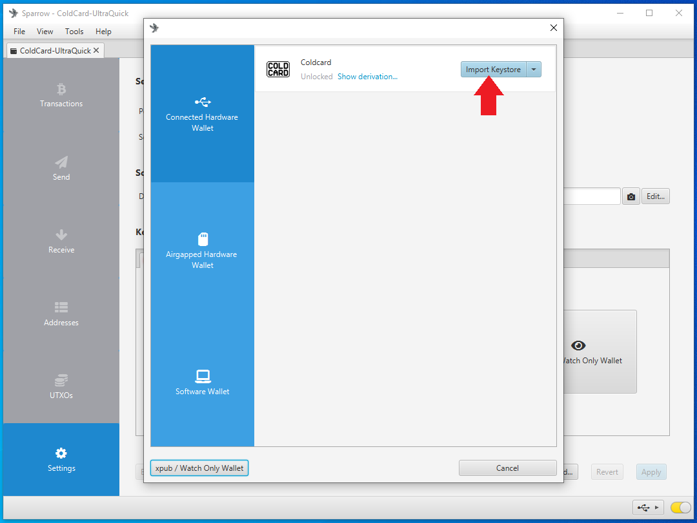

After a moment, you will see a summary of the wallet you are about to apply. You will notice a "Master fingerprint" dialog box with 8 characters in it. You can use this unique identifier to confirm that you are importing the correct wallet from your COLDCARD. On your COLDCARD, from the main menu, navigate down to `Advanced` > `View Identity` and you can compare the displayed fingerprint to the one displayed in Sparrow Wallet. If everything looks good, then click on <kbd>Apply</kbd> in Sparrow Wallet. 

  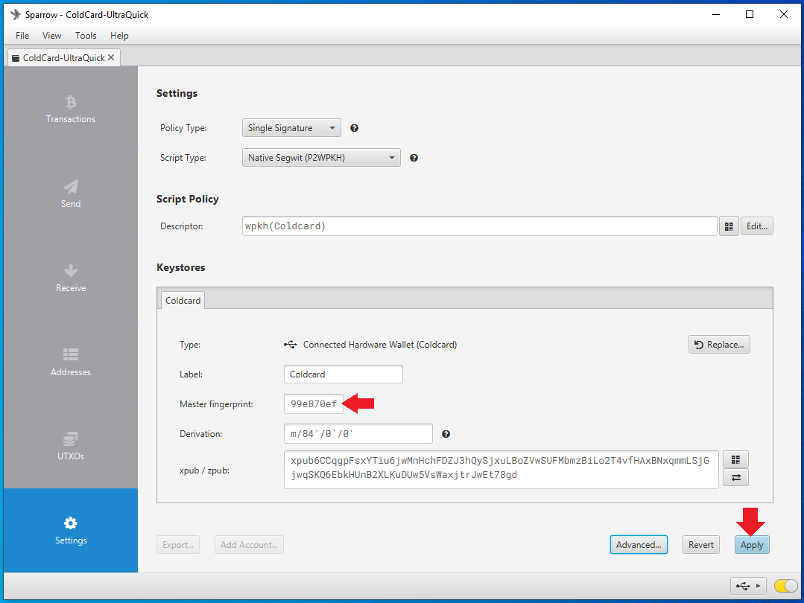
  

Next, you will have the opportunity to add a password to your wallet. This is a password which will encrypt the Sparrow Wallet data file that is saved on your computer. This password can protect your wallet if someone else gains access to your desktop and Sparrow Wallet file. If you forget your password, you will need to create a new wallet file by repeating this whole process. 

  

After the details have all been applied, then you will be at your wallet's main interface and you are ready to start transacting. 

Now you can click on the <kbd>Receive</kbd> tab on the left-hand side of the Sparrow Wallet interface. Then you will be presented with a bitcoin receiving address, a QR code, and some additional details. You can scan this QR code with your mobile Bitcoin wallet, for example, and deposit some bitcoin to your COLDCARD. You should see the transaction show up in Sparrow Wallet after a moment. The transaction will remain in a pending status until it receives some blockchain confirmations. In the mean-time, you can click on the <kbd>Transactions</kbd> tab and review further details about your transaction. You can also copy/paste your transaction ID in [mempool.space](https://mempool.space/) to watch for your first confirmation, or use whatever your preferred block explorer is. [Tor Browser](https://www.torproject.org/download/) is a privacy-focused browser.  

  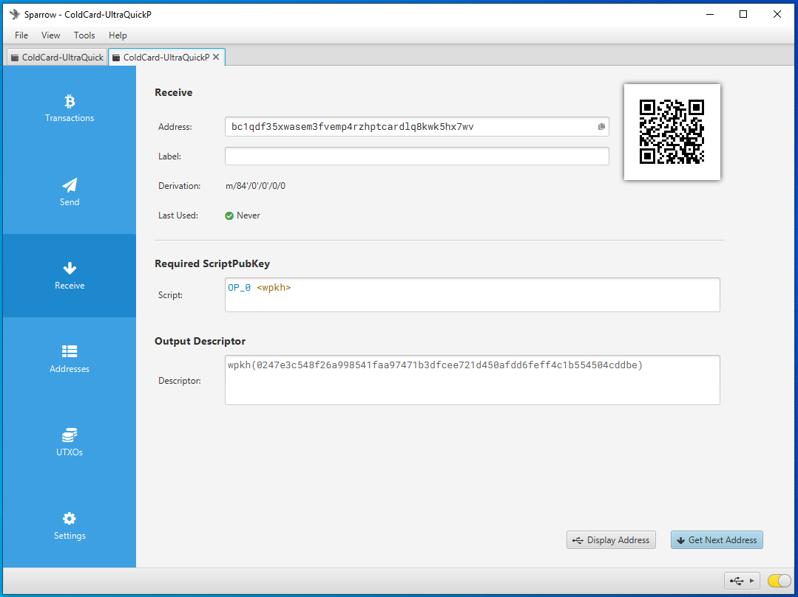
  
  

  
  

  
  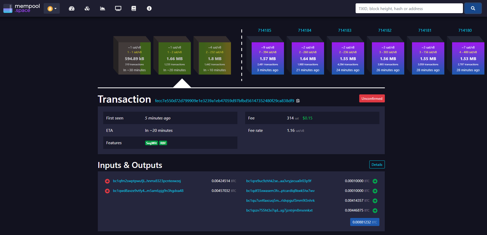

You can disconnect the COLDCARD from the computer and when you open the wallet in Sparrow Wallet in the future, several addresses will be saved so you can continue depositing to your COLDCARD without having to reconnect it every time. It is best practice to confirm each receiving address on the COLDCARD itself and also to only use each address once. 

When you are ready to spend bitcoin from your COLDCARD, navigate to the <kbd>Spend</kbd> tab on the left-hand side in Sparrow Wallet. There, you can paste the address you are sending to, add a label, enter an amount to send, and choose a miners fee rate, etc. Once you have everything set, click on <kbd>Create Transaction</kbd>. On the next screen, click on <kbd>Finalize Transaction for signing</kbd>. 

  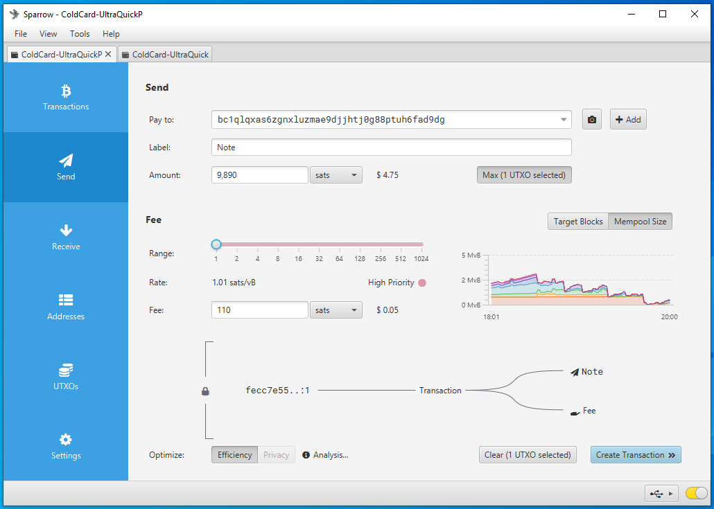
  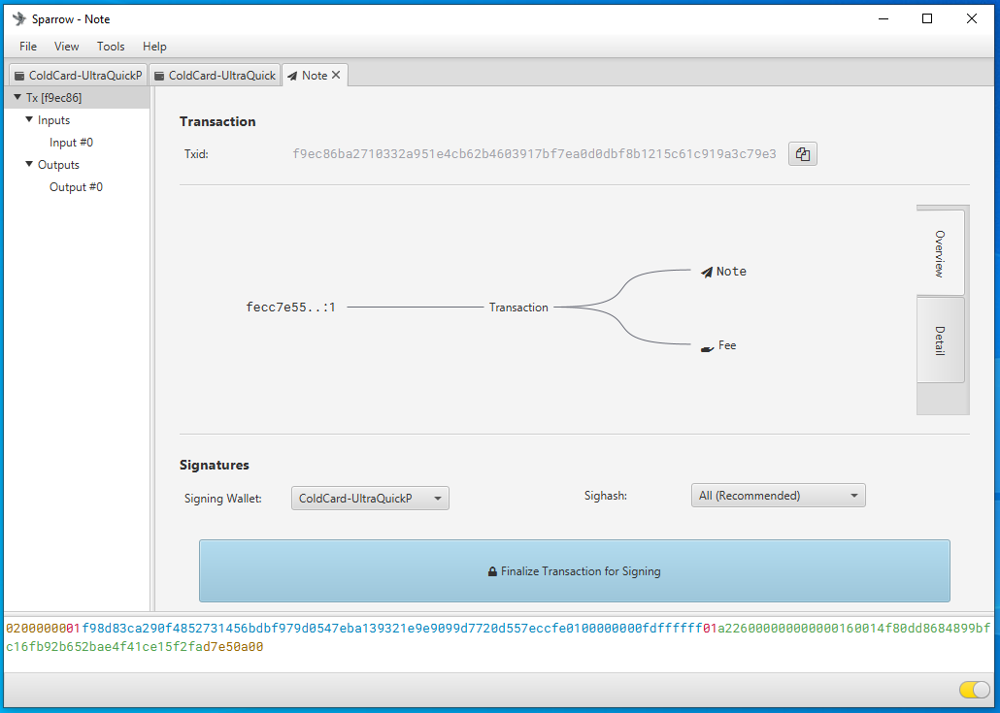
  

  
Next, you will be asked to sign the transaction using your COLDCARD. You can deposit bitcoin with your COLDCARD disconnected but to spend bitcoin, the COLDCARD needs to sign the transaction. Sparrow Wallet is used to build the transaction based on your deposits and the information you entered when constructing the transaction. Connect your COLDCARD to your computer and log into it if you have not done so already, then in Sparrow Wallet click on the <kbd>Sign</kbd> button. A pop up window will display the option for COLDCARD, click on the <kbd>Sign</kbd> button.

  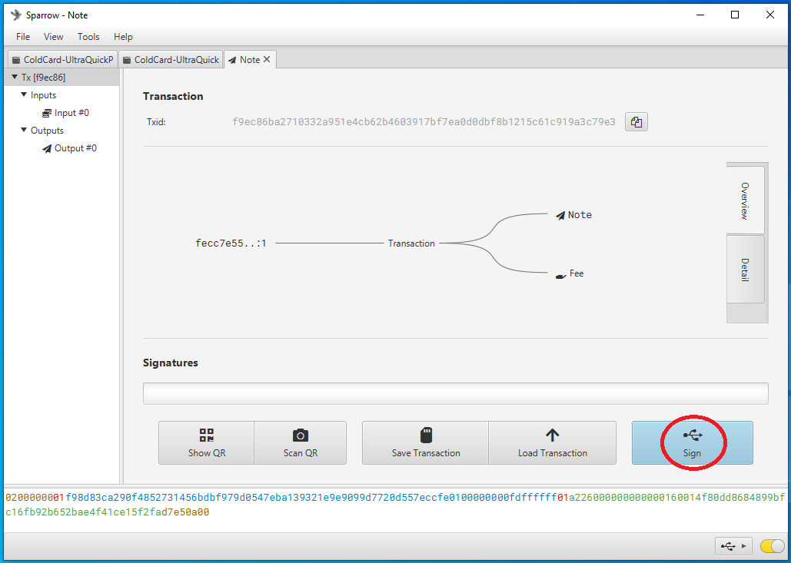
  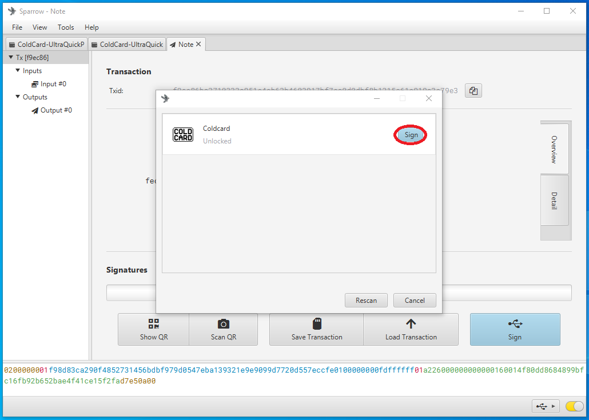
  

 
A moment later on the COLDCARD, it will ask you to confirm. Hit the <kbd>OK</kbd> button and the COLDCARD will sign the transaction and pass the details back to Sparrow Wallet. Then in Sparrow Wallet, click on the <kbd>Broadcast Transaction</kbd> button to send the signed transaction to the Bitcoin Network. 

  

  
  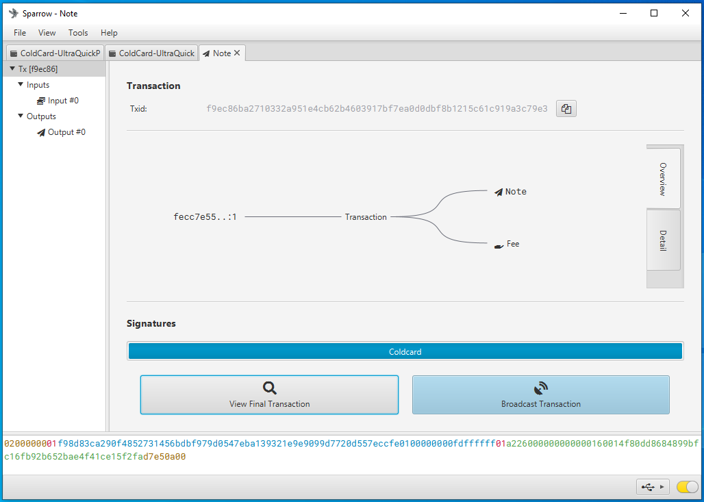
  

## Conclusion
That is all for this guide. You should have the knowledge now to check your tamper-evident bag, setup a PIN, create & backup a seed phrase, as well as connect your COLDCARD to Sparrow wallet and make some transactions. Both COLDCARD and Sparrow Wallet have more advanced features which you can learn about in the [Middle Ground](https://www.github.com/econoalchemist/ColdCard-MiddleGround/) guide or the [Paranoid](https://www.github.com/econoalchemist/ColdCard-Paranoid/) guide. Be sure to power down your COLDCARD, disconnect it, and secure it in a safe place.  

