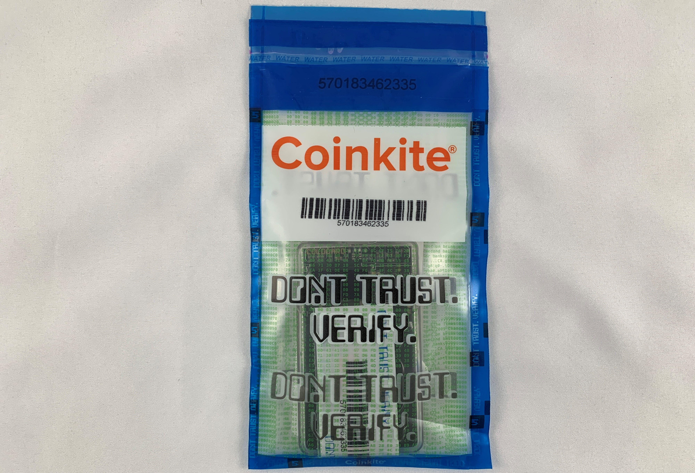
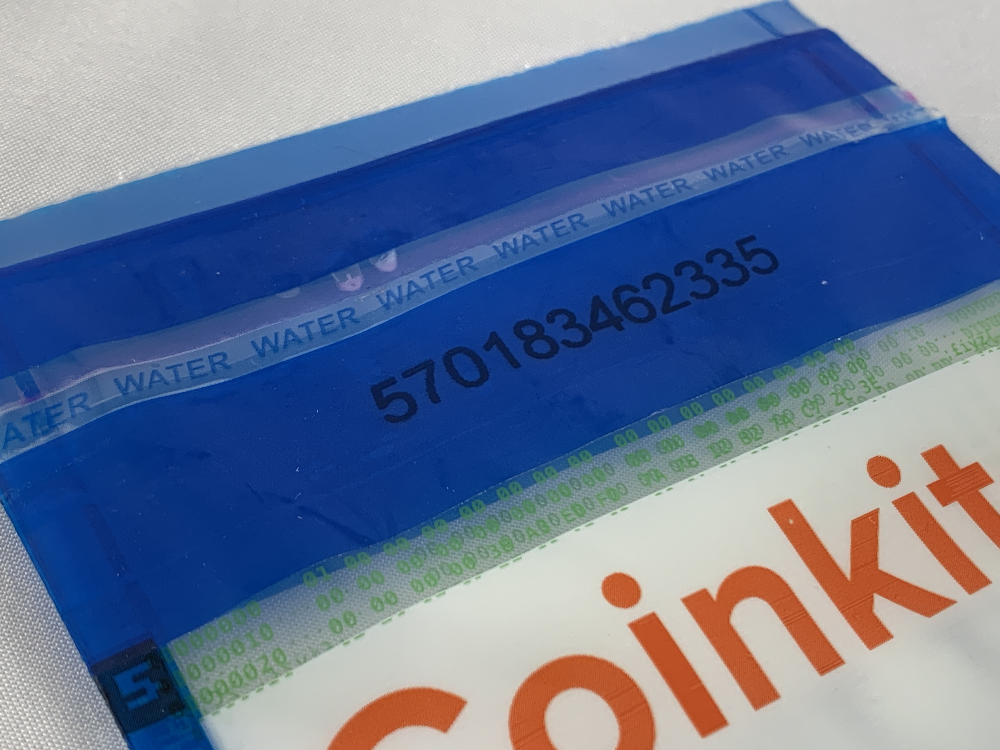

# ColdCard Ultra Quick Guide
An ultra quick guide for beginners to get you from zero to self-custodied cold storage in as few steps as possible. 

This guide covers:
- Checking the tamper-evident bag
- Setting up a PIN
- Generating a seed phrase
- Connecting ColdCard to [Sparrow Wallet](https://www.sparrowwallet.com/)

## Checking the tamper-evident bag:

Upon receiving your ColdCard, ensure that the tamper-evident bag has not been compromised. If anything seems amiss or if you have any problems contact [support@coinkite.com.](mailto:support@coinkite.com?subject=%5BContact%5D%20-%20) Visually inspect the surfaces and edges of the bag for indications of tampering, openings, or damage.  

 
