# ColdCard Ultra Quick Guide
An Ultra Quick guide for beginners to go from zero to self-custodied cold storage in as few steps as possible. 

  

This guide covers:
- Checking the tamper-evident bag
- Setting up a PIN
- Generating a seed phrase
- Connecting & transacting with [Sparrow Wallet](https://www.sparrowwallet.com/)

## Checking the tamper-evident bag:
Upon receiving your ColdCard, ensure that the tamper-evident bag has not been compromised. If anything seems amiss or if you have any problems contact [support@coinkite.com.](mailto:support@coinkite.com?subject=%5BContact%5D%20-%20) Visually inspect the surfaces and edges of the bag for indications of tampering, openings, or damage.

  
  

  
  

You will see the tamper-evident words "VOID" appear when the seal is opened. Inside you will find your new ColdCard, the Wallet Recovery Backup Card, sticker(s), and an additional copy of the bag number which should match the bag number printed on the outside of the bag. 

  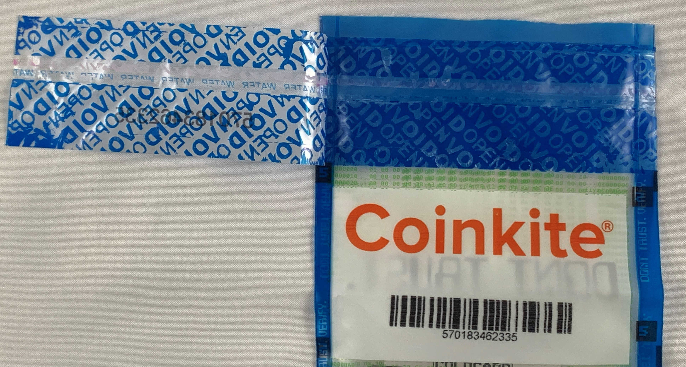
  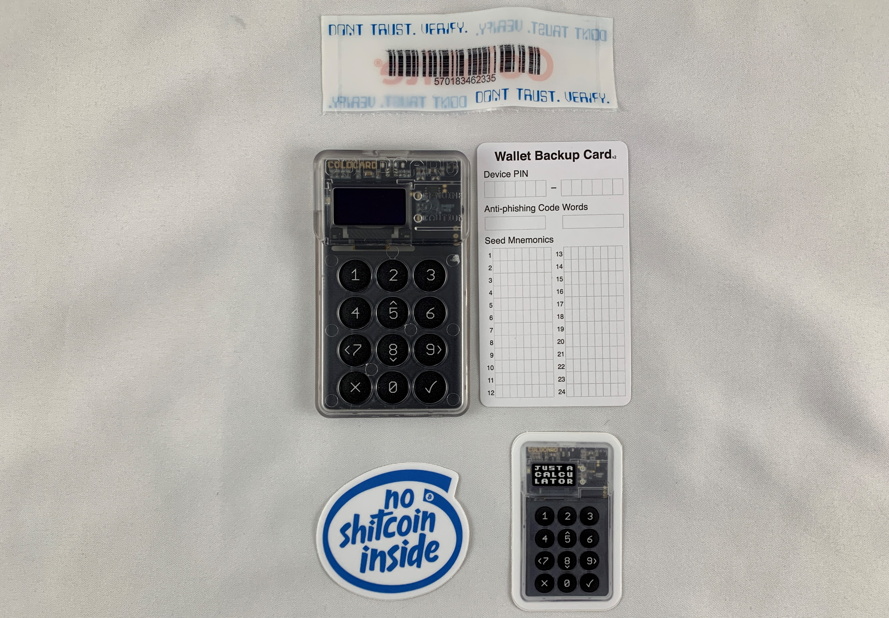

If everything looks good, then you are ready to power on your new ColdCard and get it setup. 

Here is a diagram you can reference to learn the ColdCard's navigation:

  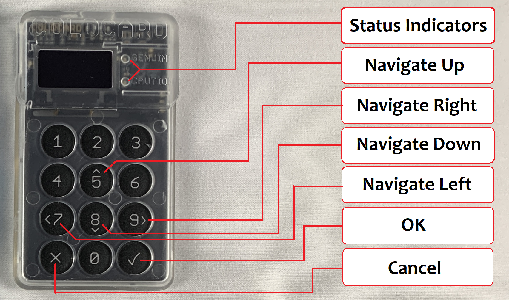

## Setting up a PIN
To power on the ColdCard simply connect a USB to micro-USB [cable](https://store.coinkite.com/store/category/accessories) to the port on top of the ColdCard and the other end to a USB port on your computer. Keep in mind, if you want to keep your ColdCard air-gapped then the [Middle Ground](https://www.github.com/econoalchemist/ColdCard-MiddleGround/) guide may be more appropriate for you, this guide will demonstrate how to use ColdCard connected to a computer.

First, read and accept the terms of sale & use. Then you will be asked to confirm the bag number. If there are any discrepancies, contact [support@coinkite.com](mailto:support@coinkite.com?subject=%5BContact%5D%20-%20).

  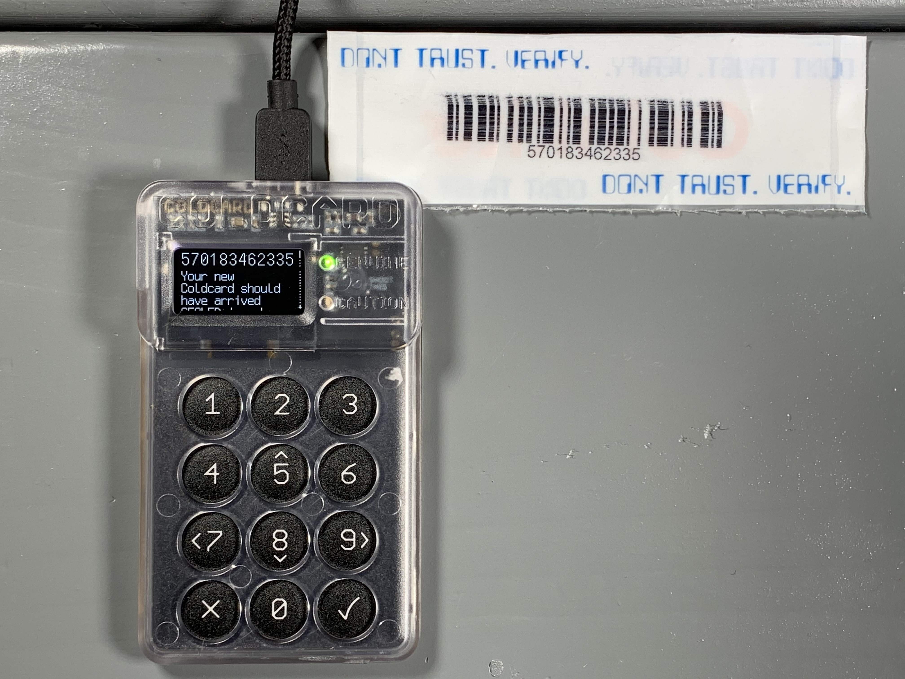

Make careful considerations with your PIN number. You don't want to use one that is easy to guess. Your PIN will have two parts, a prefix and suffix. The idea is that once you enter the prefix, you will be presented with two anti-phishing words. If the words are the same as the words that were originally presented to you at initial startup, then you know that your ColdCard has not been tampered with since the last time you accessed it. 

First, select `Choose PIN Code`, then you will see a brief description of how the PIN code works. Each part of your PIN code can be between 2 and 6 digits. There is absolutely no way to access a forgotten or lost PIN. Also, if you enter a PIN incorrectly too many times, it will brick your ColdCard as a security feature.

  

After hitting <kbd>OK</kbd> you will get one more warning about the risk of losing or forgetting your PIN. After reading that, you can enter your PIN prefix. Use the included notecard to write down your PIN prefix then hit <kbd>OK</kbd>. 

  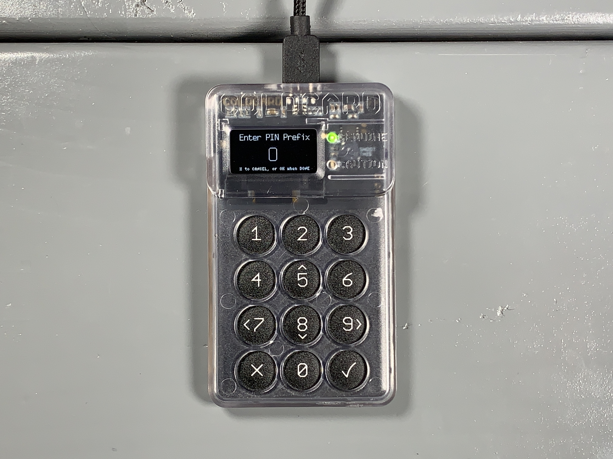
  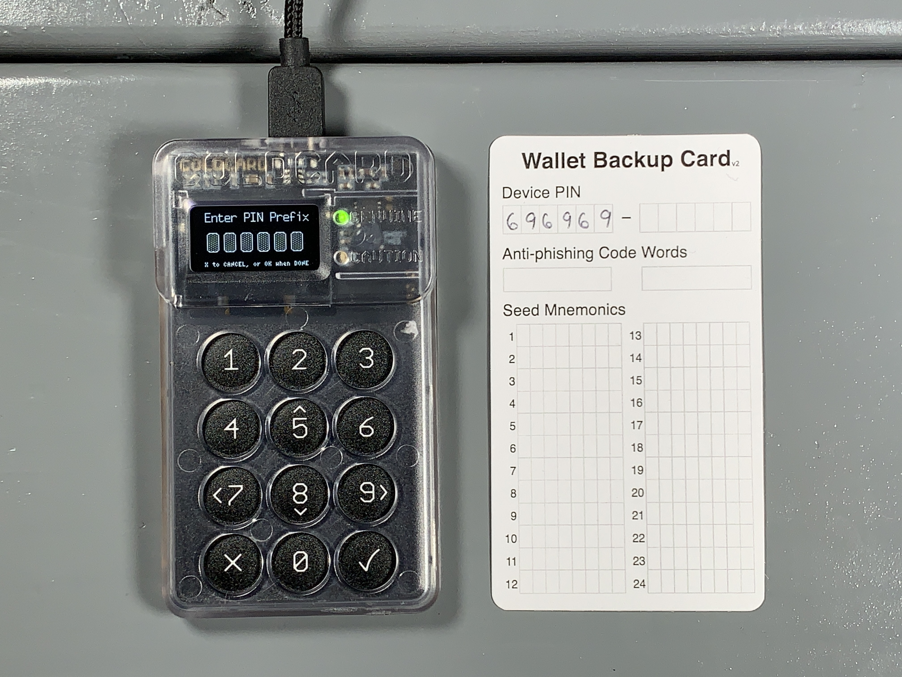

Next you will be presented with your two anti-phishing words. Write these down on your notecard.

  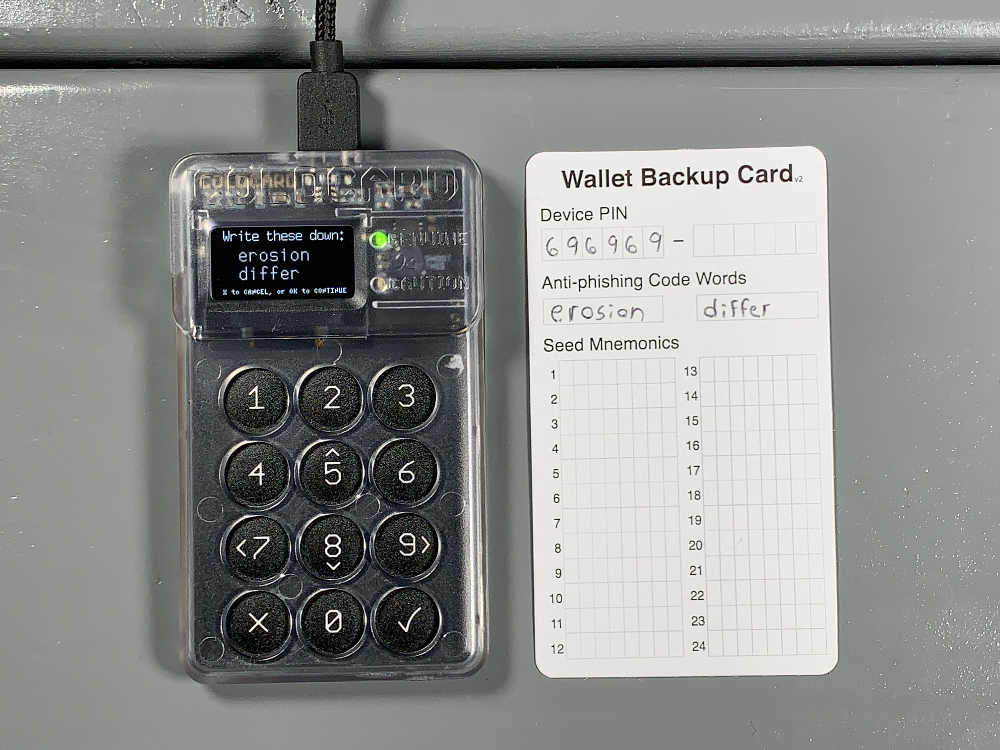

Next, enter your PIN suffix, then write it down on the notecard and hit <kbd>OK</kbd>.

  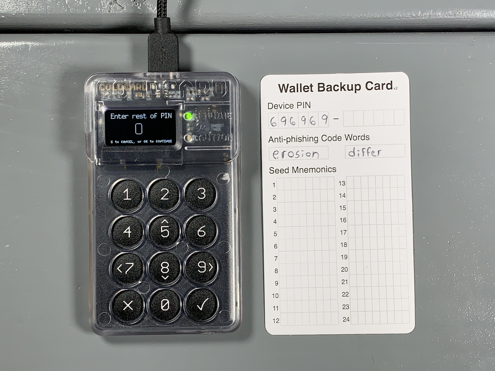
  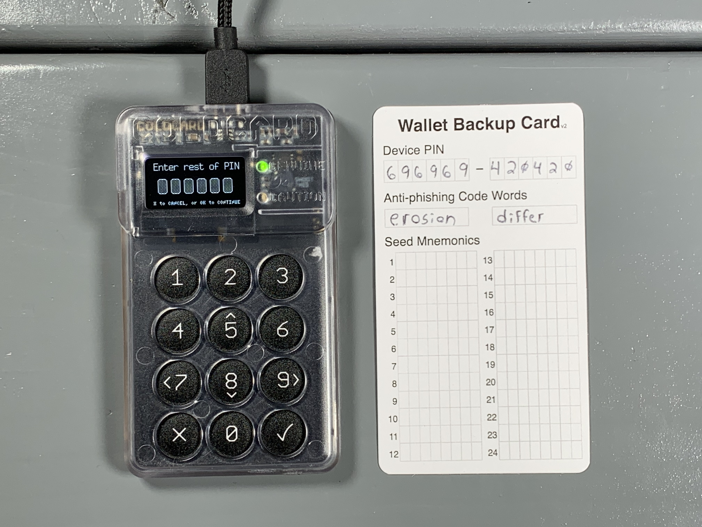

Then you will be asked to re-enter your PIN prefix, confirm the two anti-phishing words, and enter your PIN suffix. The ColdCard will save that information and then open up the wallet where you can generate your seed phrase.

## Generating a seed phrase
There are a couple considerations you may want to make when creating a seed phrase. For example, ColdCard will generate a seed phrase for you by default, as shown in this guide. However, maybe you don't trust the True Random Number Generator (TRNG) in your ColdCard, you can introduce some of your own randomness as shown in the [Middle Ground](https://www.github.com/econoalchemist/ColdCard-MiddleGround/) guide.

First, Select `New Wallet` and after a moment you will be presented with 24 words. Write these words down in order on your notecard. Then double check your work.

  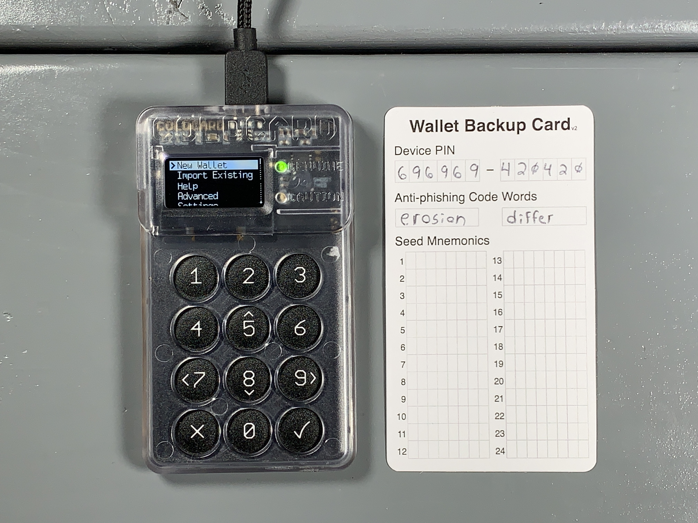
  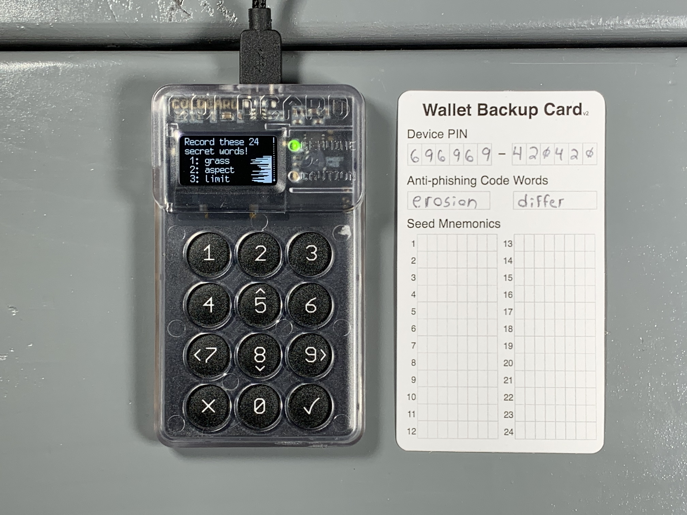
  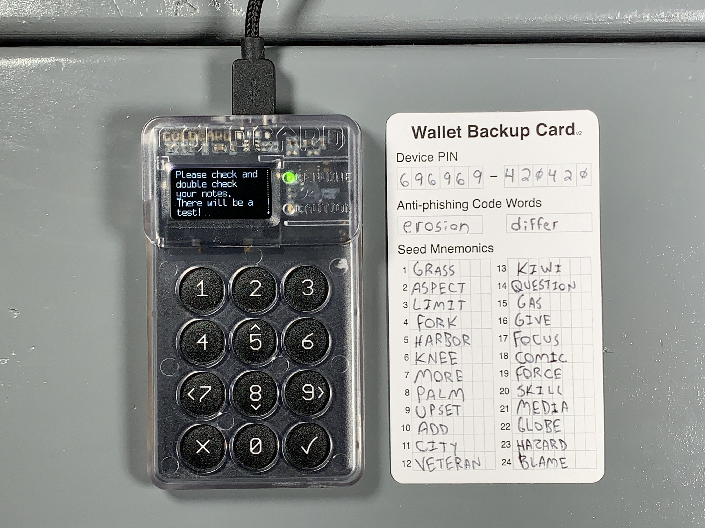

Next, you will be tested on your seed words to ensure you wrote them down correctly. After passing the test, you will be in the ColdCard main menu. Make sure you store your notecard securely. Anyone who gains access to your seed phrase will be able to steal your bitcoin. Never share your seed phrase with anyone.

  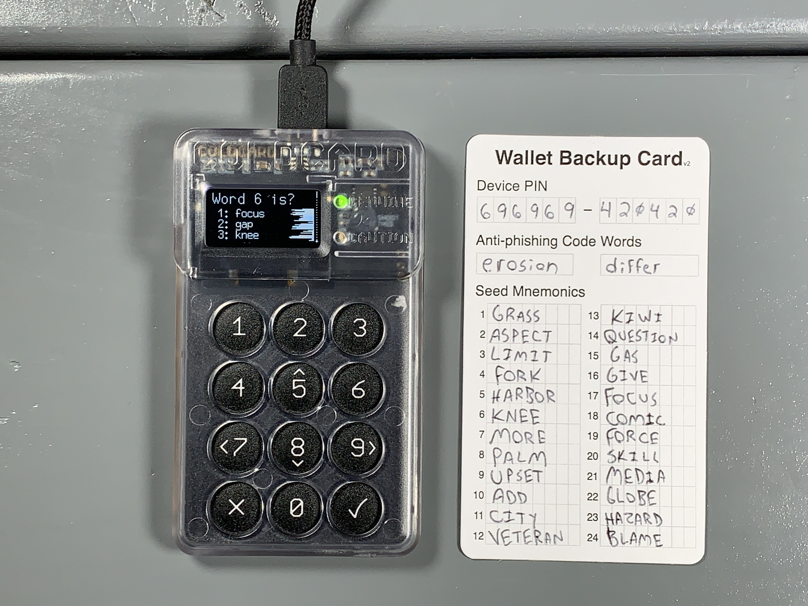

Best practice is to test your backup information before depositing any bitcoin. The basic idea is to use only your written backup information in an attempt to restore your wallet. If all of your backup information is correct and you sucessfully restore your wallet then you know that you can recover any bitcoin deposited to that wallet with that backup information. First you need a way to identify your wallet. Your newly generated wallet has a unique fingerprint which you can find from the main menu by navigating to `Advanced` > `View Identity`. You will find a unique 8-character fingerprint such as `99E870EF`. Write that fingerprint down. Now you can destroy the seed on your ColdCard by again navigating to `Advanced` then `Danger Zone` > `Seed Functions` > `Destroy Seed`. Then you will be presented with a couple of warnings, after confirming, your seed will be destroyed and you will be brought back to the login page where you enter your PIN. Log back into your ColdCard and from the main menu navigate to `Import Existing` > `24 words` and then start entering your seed words in order from your backup card. Start by scrolling down until you see the first letter of your word, then scroll down to the next nearest part of the word, and keep narrowing down the search until you arrive at the word you need. For example, `t` > `th` > `thr` > `throw` then hit <kbd>OK</kbd> and repeat the process for the next word. If you make a mistake, you can hit <kbd>Cancel</kbd> to go back and reselect a word. After you enter the 23rd word, ColdCard will compute a list of 8 possible options for your 24th word. Select your 24th word from that list. If you do not see your 24th word on that list then you either made a mistake entering the first 23 words or you wrote down your backup information incorrectly. After selecting the 24th word and hitting <kbd>OK</kbd> the seed will be applied and then you can navigate back to `Advanced` > `View Identity` and confirm the fingerprint is correct.    

## Connecting & transacting with Sparrow Wallet
Sparrow Wallet is a Bitcoin wallet designed to be connected with your own node and ran from your desktop computer. This is a user-friendly wallet with an intuitive interface and many advanced features for a range of capabilities. To learn more about Sparrow Wallet and for installation instructions, visit the [Sparrow Wallet website](https://www.sparrowwallet.com/).

In this guide you will see how to connect your ColdCard to Sparrow Wallet using a reputable public Electrum server as the backend. 

Once you install Sparrow Wallet and launch the application, you will be presented with an empty user interface. Navigate to `File` > `Preferences`.

  

Then click on the <kbd>Server</kbd> tab on the left-hand side. Select <kbd>Public Server</kbd> at the top, choose a public server from the drop down menu, then click on <kbd>Test Connection</kbd>. It should only take a moment for a sucessful connection to be made. You may have to try a couple different public servers to get a good connection. 

  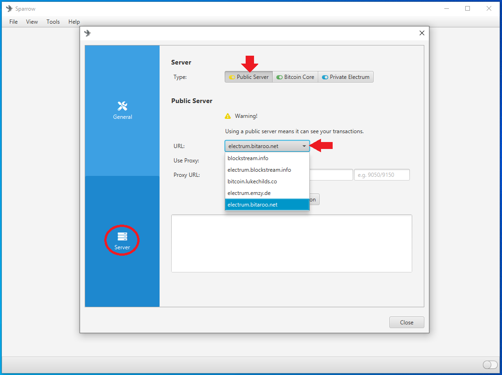
  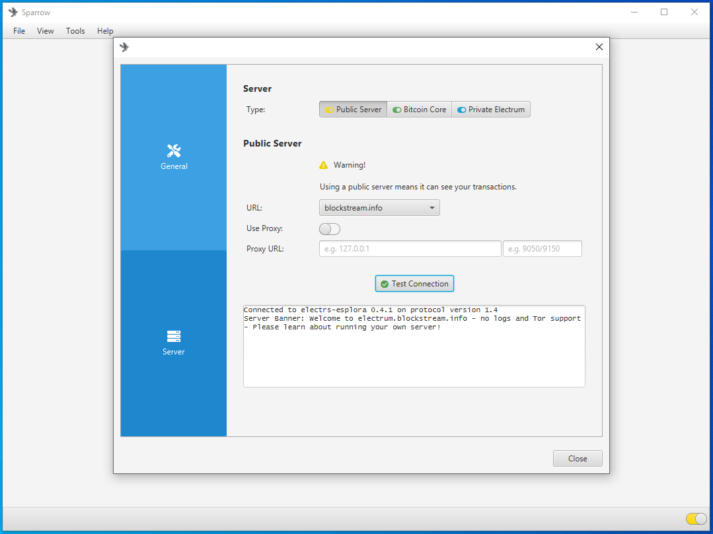

Keep in mind that with this configuration, you are using a public Electrum server which means that your transactions will broadcast to a public server. This also means you are trusting someone else's node. Your bitcoin is not at risk but this method has a privacy tradeoff that is worth considering. In the [Middle Ground](https://www.github.com/econoalchemist/ColdCard-MiddleGround/) guide, more privacy-focused options are covered. To learn more about Sparrow Wallet best practices, check out [this](https://www.sparrowwallet.com/docs/best-practices.html) guide. 

You will notice in the Sparrow Wallet interface lower right-hand corner that the toggle switch color has changed to yellow. This indicates that your wallet is using a public Electrum server as the back end. 

You can create your new wallet by selecting `File` > `New Wallet`, then you will be asked to name this wallet. Name the wallet whatever you want then click on <kbd>Create Wallet</kbd>. 

  

You will see the following screen, you can leave all the settings on the defaults. Plug your ColdCard into the desktop and log into it if you haven't done so already before clicking on the <kbd>Connected Hardware Wallet</kbd> button.

  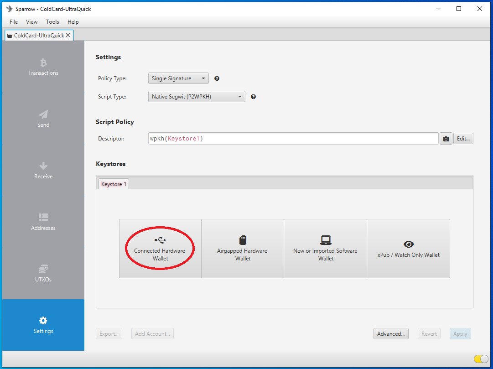

Next, a screen will pop up and you can click on the <kbd>Scan...</kbd> button. Then after a moment you should see ColdCard appear on screen with an <kbd>Import KeyStore</kbd> button, click on that button. 

  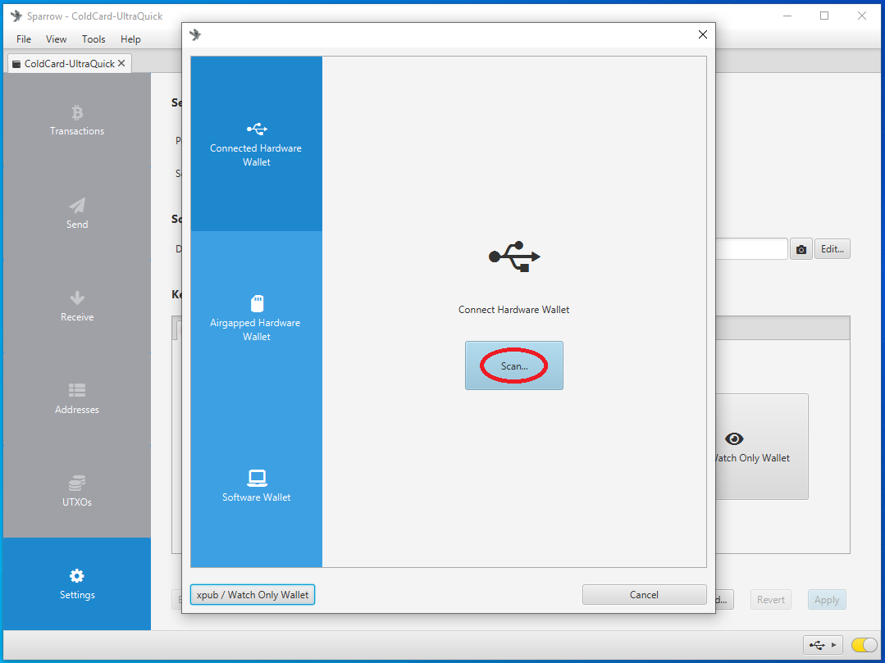
  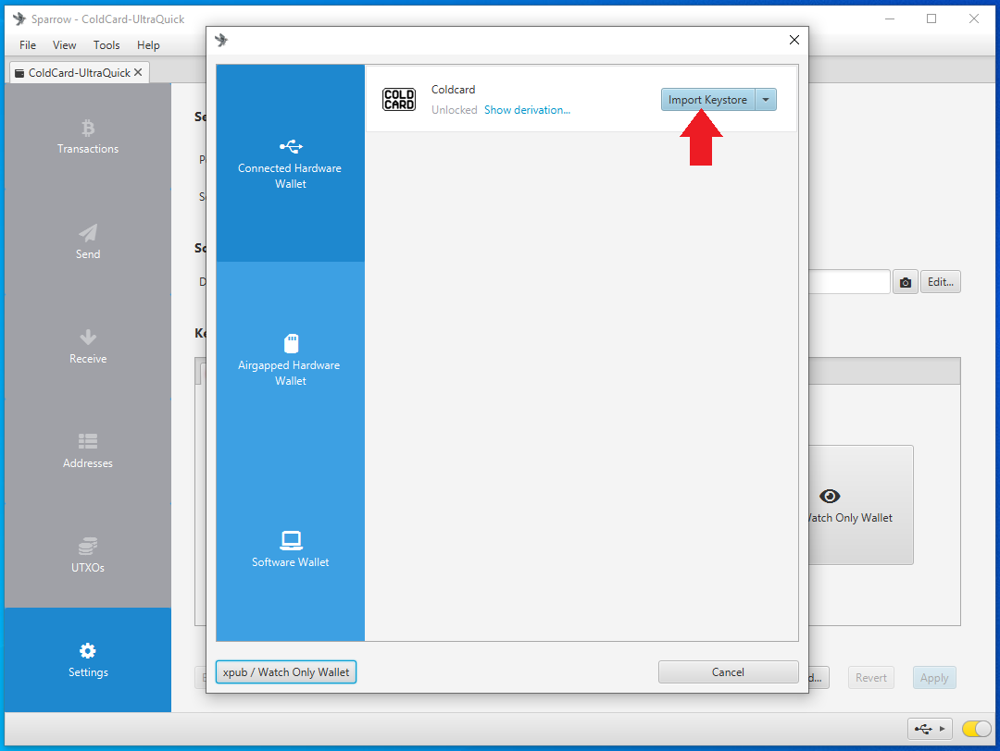

After a moment, you will see a summary of the wallet you are about to apply. You will notice a "Master fingerprint" dialog box with 8 characters in it. You can use this unique identifier to confirm that you are importing the correct wallet from your ColdCard. On your ColdCard, from the main menu, navigate down to `Advanced` > `View Identity` and you can compare the displayed fingerprint to the one displayed in Sparrow Wallet. If everything looks good, then click on <kbd>Apply</kbd> in Sparrow Wallet. 

  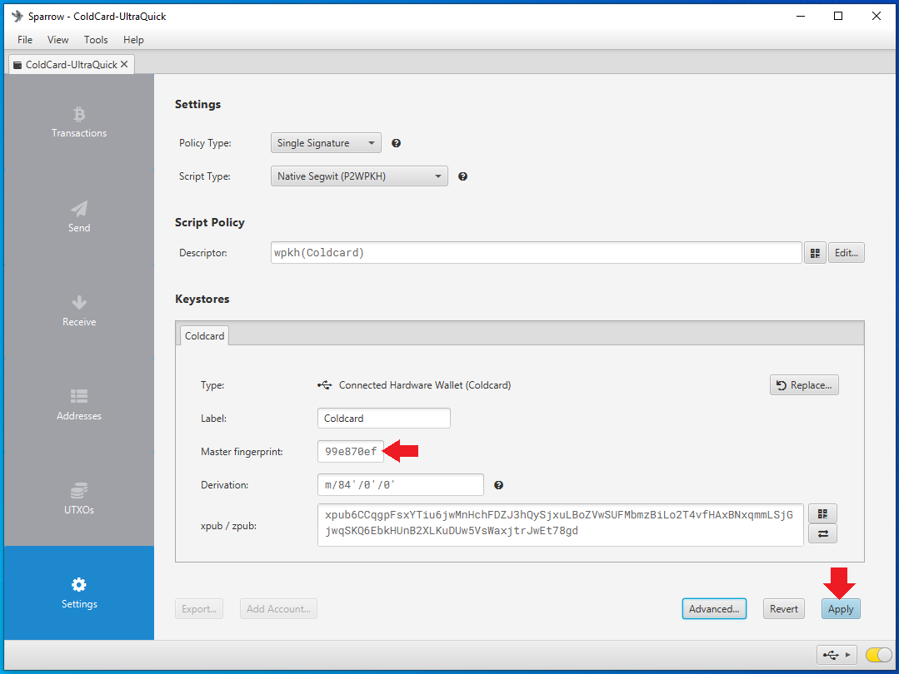
  

Next, you will have the opportunity to add a password to your wallet. This is a password which will encrypt the Sparrow Wallet data file that is saved on your computer. This password can protect your wallet if someone else gains access to your Sparrow Wallet file. If you forget your password, you will need to create a new wallet file by repeating this whole process. 

  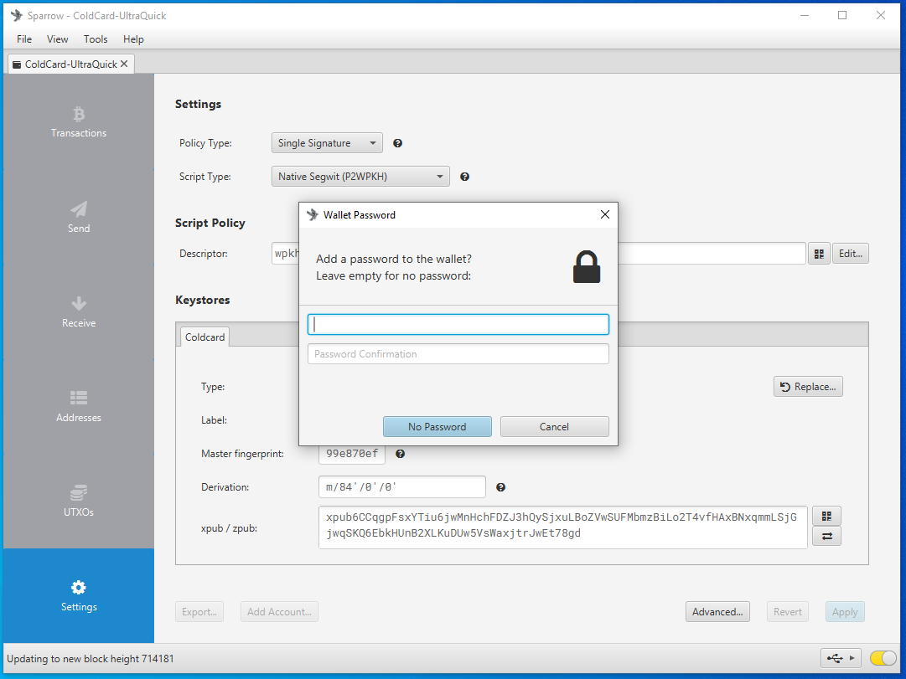

Now you can click on the <kbd>Receive</kbd> tab on the left-hand side of the Sparrow Wallet interface. Then you will be presented with a bitcoin receiving address, a QR code, and some additional details. You can scan this QR code with your mobile Bitcoin wallet, for example, and deposit some bitcoin to your ColdCard. You should see the transaction show up in Sparrow Wallet after a moment. The transaction will remain in a pending status until it receives some blockchain confirmations. In the mean-time, you can click on the <kbd>Transactions</kbd> tab and review further details about your transaction. You can also copy/paste your transaction ID in [mempool.space](https://mempool.space/) to watch for your first confirmation, or use whatever your preferred block explorer is. [Tor Browser](https://www.torproject.org/download/) is a privacy-focused browser.  

  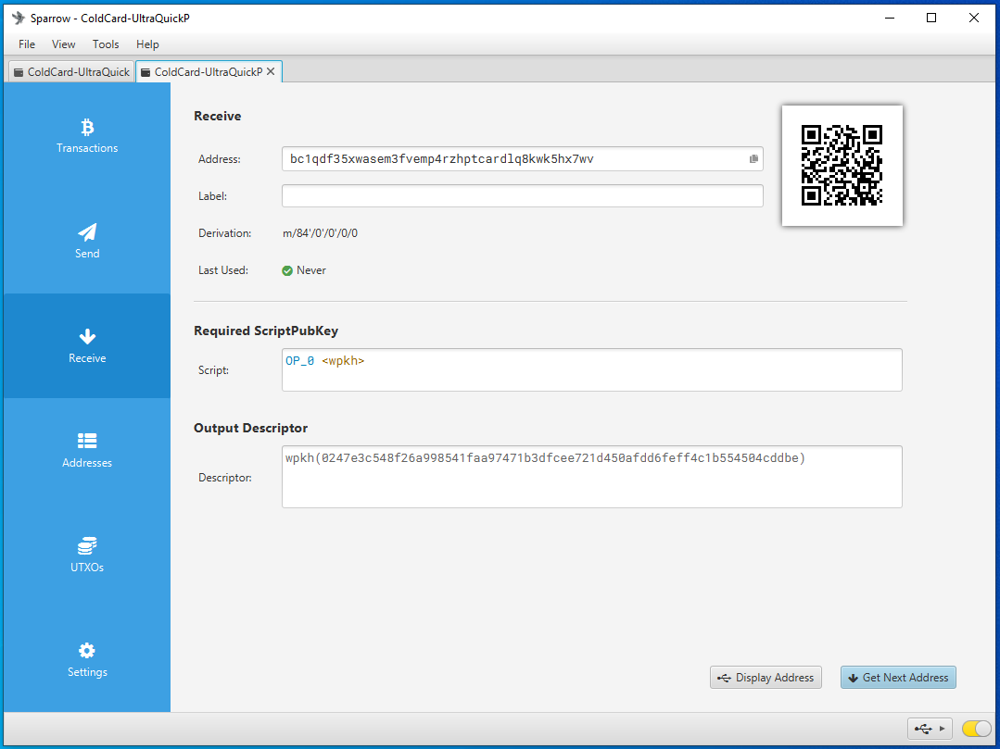
  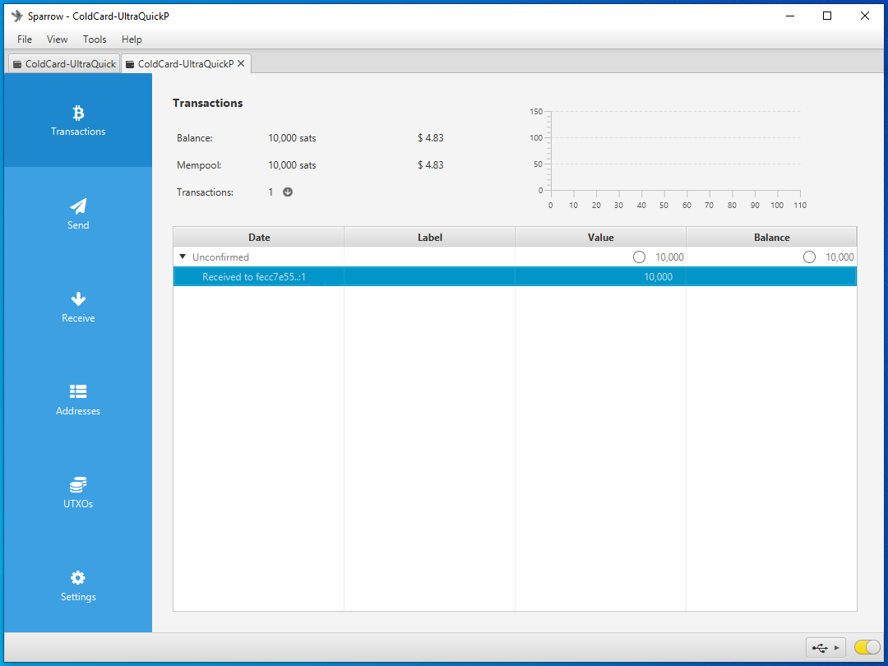
  

  
  

  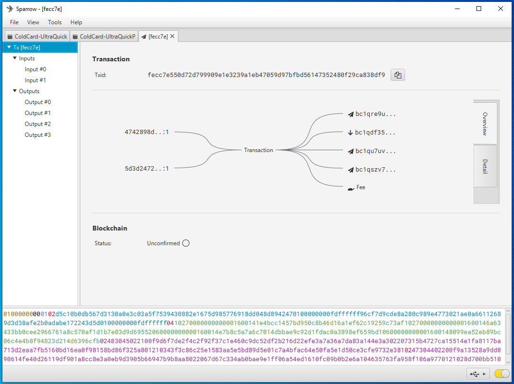
  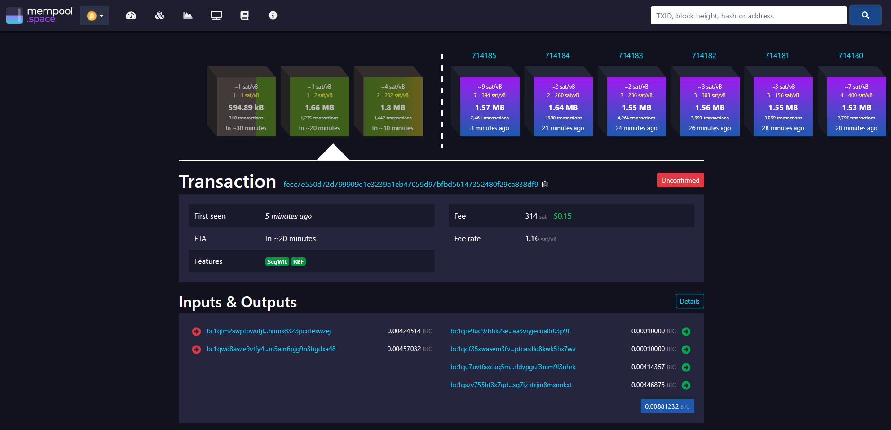

You can disconnect the ColdCard from the computer and when you open the wallet in Sparrow Wallet in the future, several addresses will be saved so you can continue depositing to your ColdCard without having to re-connect it every time. It is best practice to confirm each receiving address on the ColdCard itself and also to only use each address once. 

When you are ready to spend bitcoin from your ColdCard, navigate to the <kbd>Spend</kbd> tab on the left-hand side in Sparrow Wallet. There, you can paste the address you are sending to, add a label, enter an amount to send, and choose a miners fee rate, etc. Once you have everything set, click on <kbd>Create Transaction</kbd>. On the next screen, click on <kbd>Finalize Transaction for signing</kbd>. 

  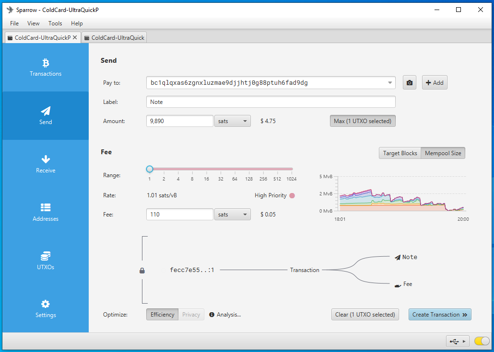
  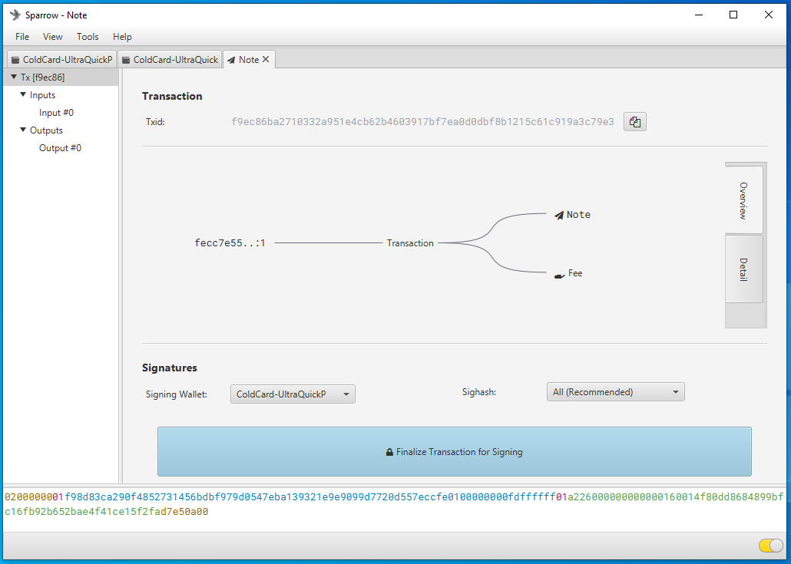
  

  
Next, you will be asked to sign the transaction using your ColdCard. You can deposit bitcoin with your ColdCard disconnected but to spend bitcoin, the ColdCard needs to sign the transaction. Sparrow Wallet is used to build the transaction based on your deposits and the information you entered when constructing the transaction. Connect your ColdCard to your computer and log into it if you have not done so already, then in Sparrow Wallet click on the <kbd>Sign</kbd> button. A pop up window will display the option for ColdCard, click on the <kbd>Sign</kbd> button.

  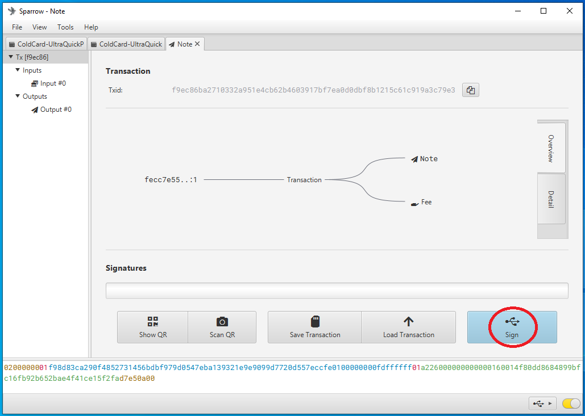
  
  

 
A moment later on the ColdCard, it will ask you to confirm. Hit the <kbd>Ok</kbd> button (Check Mark) and the ColdCard will sign the transaction and pass the details back to Sparrow Wallet. Then in Sparrow Wallet, click on the <kbd>Broadcast Transaction</kbd> button to send the signed transaction to the Bitcoin Network. 

  

  
  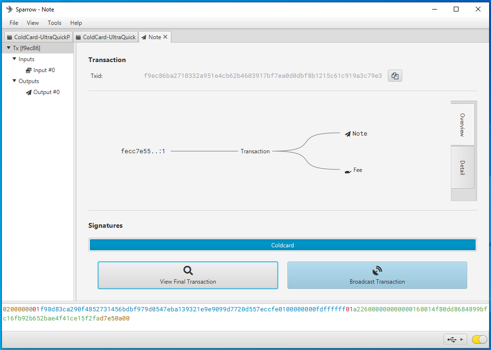
  

  
That is all for this guide. You should have the knowledge now to check your tamper-evident bag, setup a PIN, create & backup a seed phrase, as well as connect your ColdCard to Sparrow wallet and make some transactions. Both ColdCard and Sparrow Wallet have more advanced features which you can lean about in the [Middle Ground](https://www.github.com/econoalchemist/ColdCard-MiddleGround/) guide or the [Paranoid](https://www.github.com/econoalchemist/ColdCard-Paranoid/) guide. Be sure to power down your ColdCard, disconnect it, and secure it in a safe place.  
